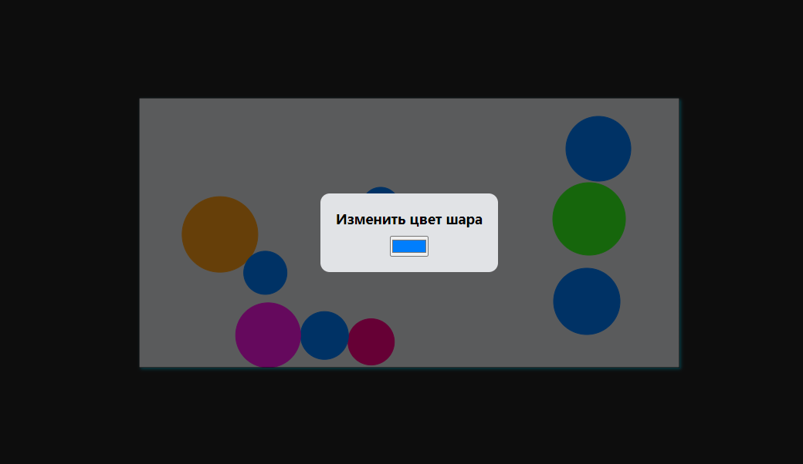

### app-canvas

#### Технологии

  
  
  

#### О проекте

На поле расположены шары разного размера. 
- Один из шаров мы приводим в движение стрелками &#8592;, &#8593;, &#8594;, &#8595;. 
- При ударе с другими шарами и границами поля часть импульса теряется
- При клике на любой шар появляется модальное окно (React Portal), с помощью которого можно поменять цвет этого шара

<!-- - Есть прямоугольное поле Canvas, на прямоугольном поле расположены шары разного размера
- Я могу толкнуть мышкой шар в сторону
- Шар упруго соударяется с другими шарами и стенками, часть импульса при соударении теряется.
- Если шар кликнуть, то появляется менюшка, выполненная с помощью React, с помощью которой можно поменять цвет заливки шара.
- Выполнить без использования сторонних библиотек отрисовки и физики. -->

#### Установка и запуск приложения

<b>Развернуть</b>

Клонировать репозиторий:

    git clone https://github.com/Mariyazakharova73/app-canvas.git

Установить зависимости:

    npm install

Запустить проект:

    npm start

  

